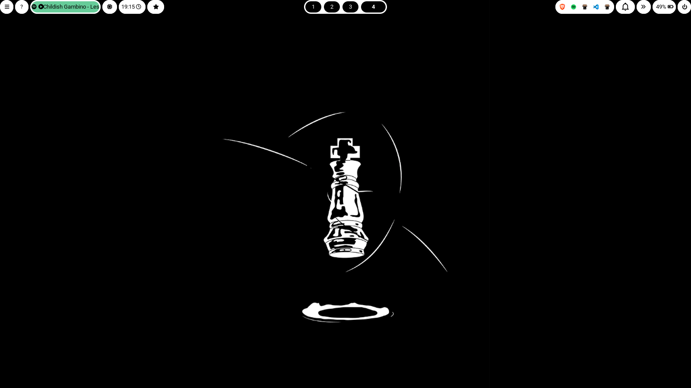
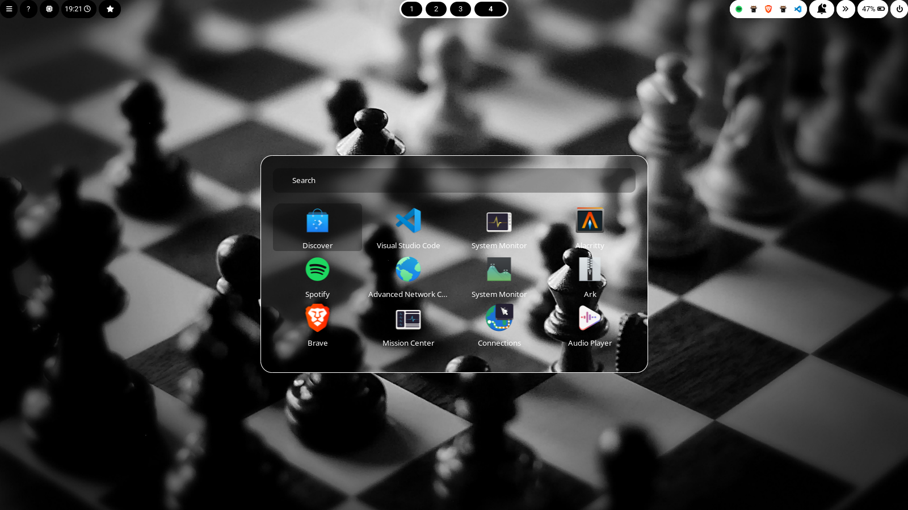
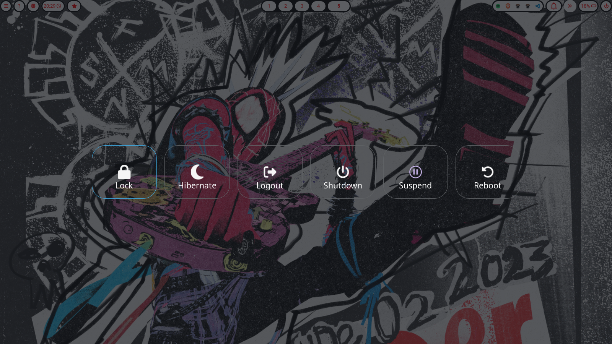
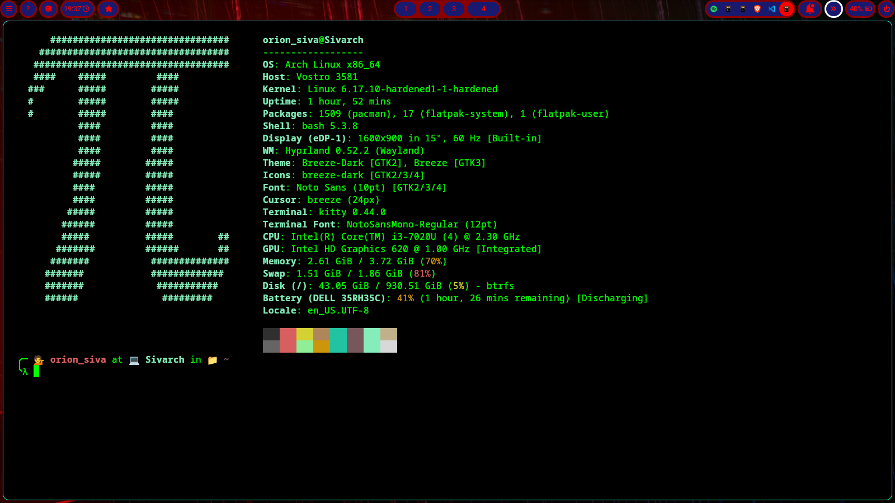
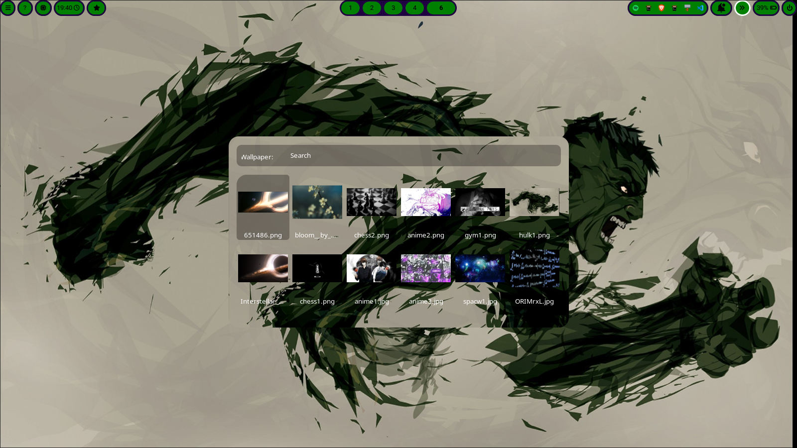

# Hyprland_dotfiles
Custom dotfiles for my Arch Linux + Hyprland setup.

## Wallpaper System (Hyprpaper)

----


My system includes a dynamic wallpaper changer with:

* **16+ wallpapers**
* **Random transition animations**
* Automatic syncing with other UI elements

___

## Rofi
---


Rofi automatically updates its background to match the current wallpaper, keeping the whole system perfectly themed.

_____

## Wlogout
___


A clean and minimal wlogout menu that matches the rest of the desktop theme.
_____

## Kitty Terminal
___

Lightly customized Kitty terminal with a theme that syncs with the wallpaper.



## Live Wallpaper Switching (Rofi Menu)
___
Switch wallpapers instantly using a custom Rofi script:




____
## Waybar
___


Waybar automatically adapts its colors based on the current wallpaper, giving you a seamless dynamic desktop theme.

___
```
This is just a fun project I built. I know some parts aren’t fully optimized yet, and a few features are still broken, but I’m improving it over time.
```

